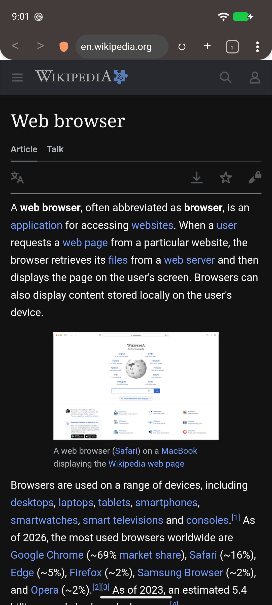
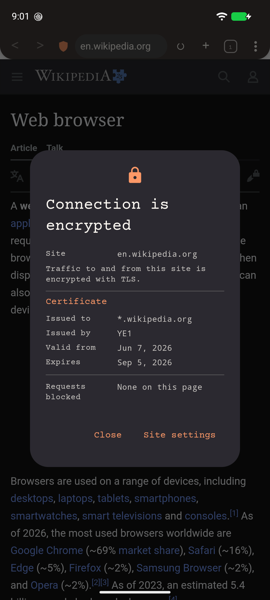
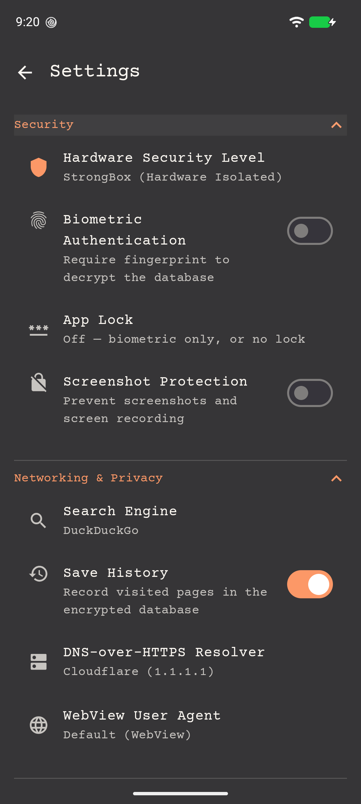
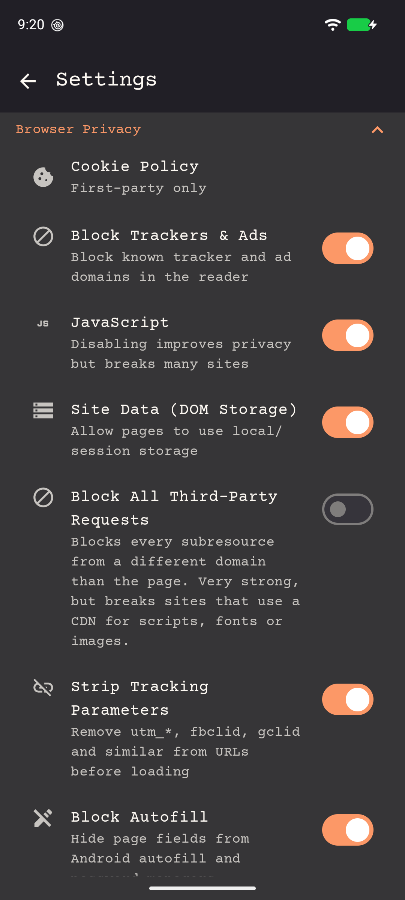
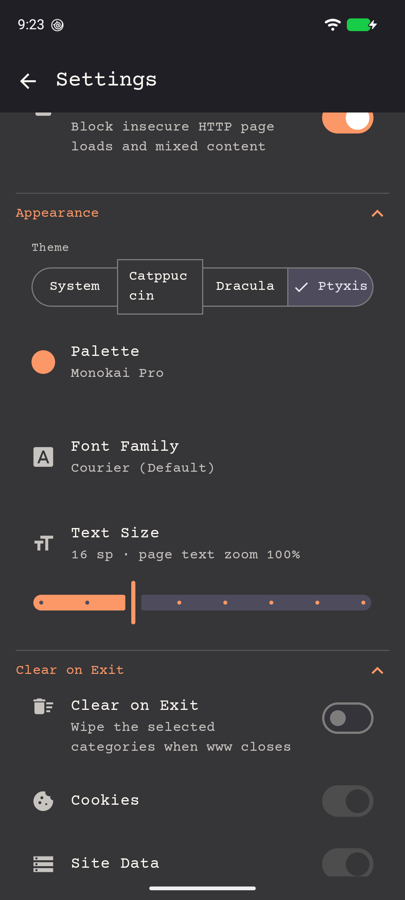

<p align="center">
  
</p>

**A private, security-hardened Android browser built on WebView — sandboxed rendering, encrypted local history, and privacy controls most mainstream mobile browsers don't expose to their own users**

[](https://kotlinlang.org)
[](https://developer.android.com)
[](https://github.com/jegly/www/releases)
[](LICENSE) [](https://developer.android.com/jetpack/compose)

If this project helped you, please ⭐️ star it. **Also try [RSS](https://github.com/jegly/rss)** — the privacy-first feed reader this browser was forked from.

---

**📱 Screenshots**

<p align="center">
  
  
  
  
  
</p>

---

## Privacy by default, not as an upsell

This project doesn't try to out-engineer the mainstream rendering engine it's built on — it uses
the same sandboxed renderer other WebView-based and Chromium-based browsers do, verified directly
on-device rather than assumed (see [Security](#security)).

What it adds on top is a set of controls most mobile browsers don't expose to their own users at
all, plus real encryption at rest that most don't offer:

- Per-toggle blocking of third-party requests, not just a fixed ad-block list
- Tracking-parameter stripping (`utm_*`, `fbclid`, `gclid`…) on every URL before it loads
- A choice of DNS-over-HTTPS resolver, not a single hardcoded default
- Per-domain overrides for user-agent, JavaScript, cookies, and images — independent of the global
  settings
- An encrypted local history/bookmarks database (SQLCipher AES-256) gated behind a passphrase —
  most browsers store this in plain SQLite
- An app-level lock (PIN, password, pattern, or biometric) independent of the device's own lock
  screen, wrapping that same encrypted passphrase
- Camera, microphone, and geolocation denied outright — no per-site prompt to manage, because
  there's nothing to grant
- Awareness of Android's device-wide Advanced Protection Mode, locking key settings on while it's
  active
- A user-toggleable screenshot/screen-recording block


---

## Features

- **Hardened WebView** — sandboxed rendering verified directly on-device (renderer runs under a
  distinct Android UID, not just a separate process); camera, microphone, and geolocation denied
  outright with no per-site prompt; no JavaScript bridge exposed to page content;
  `allowFileAccess`/`allowContentAccess` disabled so pages can't reach local files
- **Block Third-Party Requests & Ads** — fine-grained toggle to refuse every subresource from a
  domain other than the page's own
- **Tracking Parameter Stripping** — `utm_*`, `fbclid`, `gclid` and similar removed from every URL
  before it loads
- **Blanked App Identifier** — WebView tags every request with `X-Requested-With: <package name>`,
  an identifier that survives clearing cookies, changing the user agent and incognito mode. www
  blanks it profile-wide via `Profile#addCustomHeader`, which covers *every* request — top-level
  navigations, subresources (images, CSS, scripts, fonts), prefetches and service-worker requests
  alike — with no global opt-out. Verified empty on WebView 149. Two documented gaps: WebSocket
  requests are outside the API's scope, and providers too old to support `CUSTOM_REQUEST_HEADERS`
  fall back to blanking top-level navigations only
- **DNS-over-HTTPS** — choice of resolver (Cloudflare 1.1.1.1 by default); no plaintext DNS leaks
- **Per-Domain Overrides** — JavaScript, cookies, images, blocking, and user-agent can all be set
  per-site, independent of the global defaults
- **User-Agent Spoofing With Matching Client Hints** — the UA templates also rewrite the
  `Sec-CH-UA` headers, so a site reading client hints can't see past the spoof to the real engine,
  OS version and device model
- **Encrypted Database** — SQLCipher AES-256 for history and bookmarks, passphrase-gated; never
  touches disk unencrypted
- **App Lock** — PIN, password, or pattern as an alternative to biometric-only, wrapping the same
  encrypted passphrase — not just a UI gate in front of unencrypted data
- **Biometric Lock** — crypto-bound `BIOMETRIC_STRONG`; StrongBox / TEE hardware key isolation on
  supported devices
- **Advanced Protection Mode Aware** — detects Android's device-wide Advanced Protection Mode
  (API 36+) and locks Safe Browsing, Force HTTPS Only, Block Downloads, and Screenshot Protection
  on while it's active
- **Block Downloads** — toggle to refuse all file downloads outright, matching the AOSP reference
  WebView shell's behaviour
- **Incognito Mode** — cookies, storage, and cache wiped after every page load, not just on session
  close
- **Granular Clear-on-Exit** — cookies, site data, cache, and this app's own logcat buffer, each
  independently toggleable
- **Site Info Panel** — tap the address-bar shield for certificate issuer, validity dates, and
  per-page blocked-request count
- **IDN Homograph Protection** — punycode conversion and script-mixing detection against lookalike
  domains
- **`data:` Page Blocking** — top-level `data:` navigation is refused from pages and from the
  address bar; it renders attacker-authored markup in an origin no URL bar can describe honestly
- **Long-Press Link Menu** — hold any link to open it in a background tab, copy its address, or act
  on the image behind it
- **Force-Dark Web Content, Wide Viewport, Swipe-to-Refresh** — display controls most WebView-based
  browsers skip
- **Screenshot Protection** — toggleable `FLAG_SECURE`, blocks screen capture and app-switcher
  thumbnails
- **Themes** — System / Catppuccin / Dracula / Ptyxis, plus three light "paper" palettes (Rosé
  Pine Dawn, Everforest Light, Kanagawa Lotus), each with its own accent wheel

## Security

| Layer | Detail |
|-------|--------|
| Database | SQLCipher AES-256; passphrase gated on launch; `allowBackup=false` |
| Keys | AES-256-GCM via Google Tink; StrongBox hardware isolation on supported devices, TEE fallback |
| Biometric / App Lock | `BIOMETRIC_STRONG` crypto-bound, or PIN/password/pattern; passcode wraps the real database passphrase (verify-before-delete on change) rather than gating a plaintext key |
| Network | `network-security-config` restricts trust anchors to system CAs only (rejects user-installed CAs — closes the common MITM-via-sideloaded-certificate path most browsers leave open); cleartext forbidden at the OS level; DNS-over-HTTPS |
| Local network | No `ACCESS_LOCAL_NETWORK` declared (Android 17+) — verified live: page content cannot reach the device's own LAN/router at all |
| WebView | Renderer confirmed to run under a distinct Android UID (`sandboxed_process0`), not merely a separate PID; camera/mic/geolocation denied outright; no JS bridge; `allowFileAccess=false`; mixed content forbidden while Force HTTPS Only is on (the default); Safe Browsing; WebView usage-statistics upload to Google disabled app-wide via `MetricsOptOut`, regardless of the device-level setting (crash reporting is a separate channel and remains under the user's own consent); per-domain and global cookie/tracker/third-party controls |
| App hardening | Advanced Protection Mode–aware setting locks; screenshot protection toggle; biometric/passcode gate before database unlock |

## Install

1. Download the APK from [Releases](https://github.com/jegly/www/releases/latest)
2. **Settings → Apps → Install unknown apps** → allow your file manager
3. Open the APK and tap Install

Requires Android 13+.

## Build from Source

```
git clone https://github.com/jegly/www.git
cd www
./gradlew assembleRelease
```

**Prerequisites:** JDK 17, Android SDK (compileSdk 37)


## License

GNU General Public License v3.0 — see [LICENSE](LICENSE). Anyone redistributing this code, modified
or not, must keep the copyright/license notices attached and release their own modifications under
the same license.

---

**[www.jegly.xyz](https://www.jegly.xyz)**

[](https://www.buymeacoffee.com/jegly)

---
